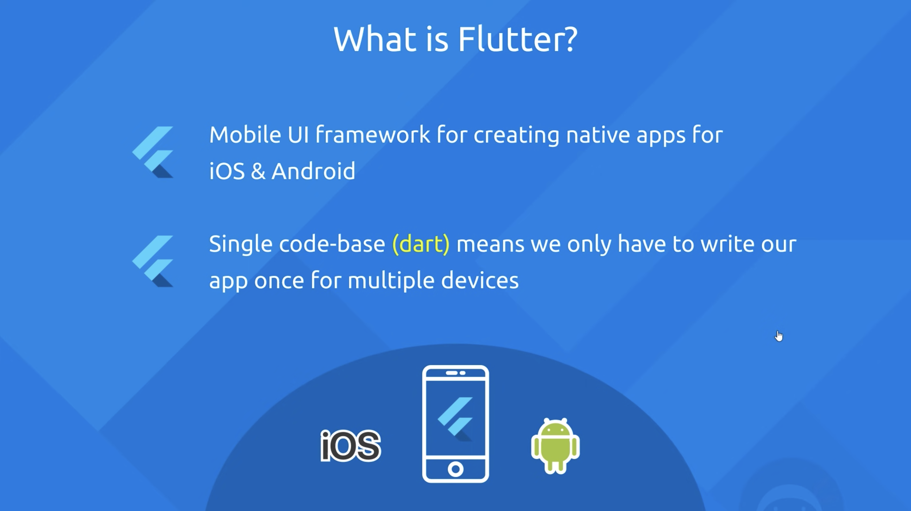
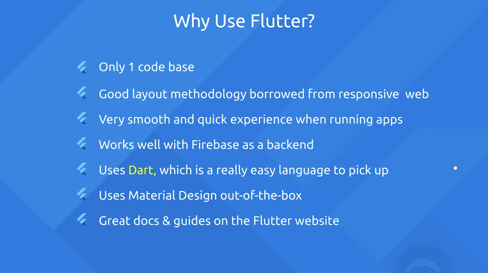

# Tutorial 2: The Net Ninja Flutter Tutorial

1. Intro & Setup
1. Flutter Overview
1. Dart Primer
1. Creating a Flutter App in Android Studio
1. Scaffold & AppBar Widgets
1. Colours & Fonts
1. Stateless Widgets & Hot Reload
1. Images & Assets
1. Buttons & Icons
1. Containers & Padding
1. Rows
1. Columns
1. Flutter Outline & Shortcuts
1. Expanded Widgets
1. Ninja ID Project
1. Stateful Widgets
1. Lists of Data
1. Custom Classes
1. Cards
1. Extracting Widgets
1. Functions as Parameters
1. Starting the World Time App
1. Maps & Routing
1. Widget Lifecycle
1. Asynchronous Code
1. Flutter Packages (http)
1. World Time API
1. WorldTime Custom Class
1. Error Handling
1. Passing Route Data
1. Formatting & Showing Dates
1. Loaders / Spinners
1. Ternary Operators
1. List View Builder
1. Updating the Time

# Tutorial 1: Wordpair Generator

Please follow [Brad Traversy's Tutorial](https://www.youtube.com/watch?v=1gDhl4leEzA) or check out [the original document](https://flutter.dev/docs/get-started/codelab).

